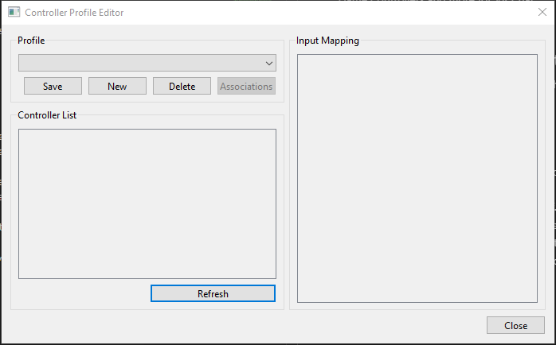

# Umami
Game Controllers and more for VR Chat.

## How to use (End User)
### Create a Controller Profile
To create a controller profile, from the main window, click on "Edit Profiles".  
From there, you can click on "New" to create a new profile with a specific name you would like to have it labeled as.  
Next, select a controller you would like to use by clicking on the checkbox of the controller in the controller list.  
The controllers axis, buttons, and povs will be displayed in the "Input Mapping" section of the editor.  
From here, you can assign an axis, button, or pov a specific input id that you would like to use in a VRChat world that supports Umami Input.  
Lastly, click on "Save" to save your profile.  
You can always come back to the editor to change the input id's of a profile if you need to readjust it.

### Use a Controller Profile
To use a created profile, all that is needed is to select it in the drop down box and Umami will load up the profile along with enabling the controllers themselves.

### Connecting to VRChat via Open Sound Controller (OSC)
To connect to VRChat via OSC, set the Remote IP and Remote Port of the computer that VRChat is running on.  By Default, this is 127.0.0.1 and 9000 which is the local computer that both Umami and VRChat are running on.  To receive OSC messages from VRChat, make sure that the listen port is set to the correct port that VRChat will send messages to.  By Default, this is set to 9001.

## How to use (World Creators/Item Creators)
Umami uses the following OSC addresses when communicating with your world:  
- /Umami/input/Axis  
- /Umami/input/Button  
- /Umami/input/POV  

Each of these addresses listed above has two values attached to it, an integer indicating the input id and it's associated value.  
Axis has a float value between -1.0f and 1.0f.  
Buttons have a boolean indicating whether a button is pressed (true) or released (false).  
POVs are a bit unique in that they use a 4 bit integer to indicate it's input, similar to how a button works but the first bit is for up, second for down, third for left, and fourth for right.

## Features
- Remappable Input
- Controller Profiles

## Planned Features
- Force Feedback
- Auto profile switching

## Screenshots
Umami:  
  
Controller Profile Editor:  
  
Controller Configuration:  

