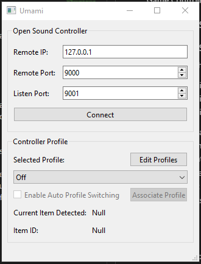
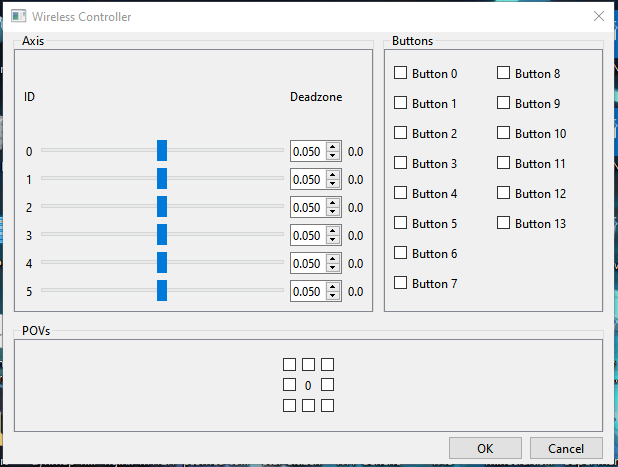

# Umami
Game Controllers and more for VR Chat.

## How to use (End User)
- Select which controller you would like to use in the controller list.
- - Configure it as nessesary. (Deadzone correction is per axis and defaults to 0.05)
- Assign which input you would like for Axis, Buttons, and POVs.
- - A value of "-1" effectively disables the input.
- Connect to VRChat's Open Sound Controller system via IP and Remote Port.
- - Note: You can accept the firewall settings when it pops up but it is not required for functionality.

## How to use (World Creators/Item Creators)
Umami uses the following OSC addresses when communicating with your world:  
- /Umami/input/Axis  
- /Umami/input/Button  
- /Umami/input/POV  

Each of these addresses listed above has two values attached to it, an integer indicating the input id and it's associated value.  
Axis has a float value between -1.0f and 1.0f.  
Buttons have a boolean indicating whether a button is pressed (true) or released (false).  
POVs are a bit unique in that they use a 4 bit integer to indicate it's input, similar to how a button works but the first bit is for up, second for down, third for left, and fourth for right.
## Planned Features
- Controller profile system.
- Auto profile switching.

## Screenshots
Umami:  
  
Controller Configuration:  
